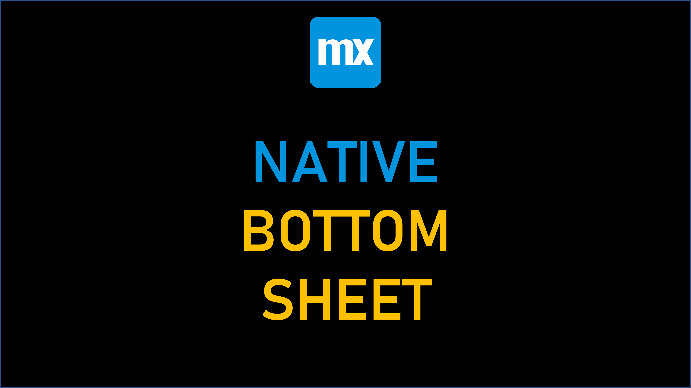

## MxRNBottomSheet

## Features
Modal overlay
Open action
Close action

## Usage
Download from the marketplace
OR
1. Make your build `npm run build`
2. Copy to the widgets directory
3. Synchronize project directory
4. Place on a page
